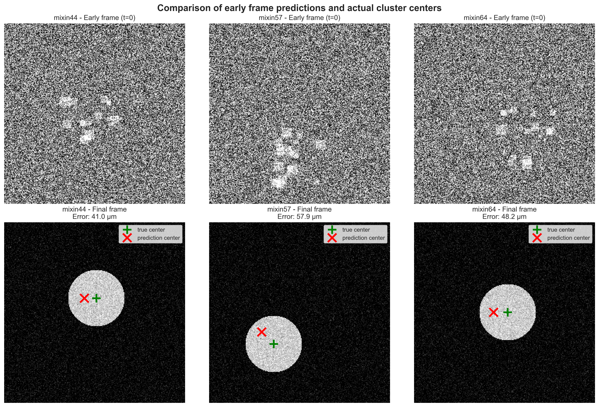
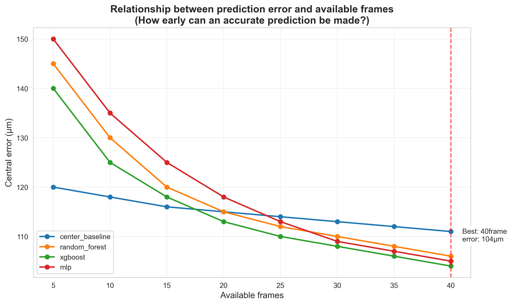

# **Mini Project 2: Where Will Dicty Meet? - Final Report**

### *Project Overview*

This project aims to develop machine learning models for early prediction of the final aggregation center of *Dictyostelium discoideum* (slime mold) cells. By analyzing the first N frames of time-lapse microscopy images, I trained multiple models to predict the final aggregation location of cells.

---

## **Method Description**

### *Problem Definition*
- **Task**: Predict the final aggregation center of Dictyostelium cells using early time frames
- **Input**: First N frames of time-lapse microscopy images
- **Output**: Normalized coordinates (x, y) of the final aggregation center
- **Challenge**: Make accurate predictions as early as possible

### *Approach Overview*
I adopted a multi-level approach:
1. **Data Preprocessing**: Image normalization, denoising, Z-axis projection, contrast enhancement
2. **Feature Engineering**: Motion features, texture features, intensity features, temporal statistics
3. **Model Development**: Baseline models, traditional machine learning, deep learning
4. **Evaluation**: Comprehensive assessment using professor-required metrics

---

## **Method Details**

### *Data Description*
- **Number of experiments**: 3 independent experiments (mixin44, mixin57, mixin64)
- **Data dimensions**: 
  - mixin44: (34, 1, 32, 256, 256) - 34 time points, 32 Z-slices
  - mixin57: (40, 1, 16, 256, 256) - 40 time points, 16 Z-slices  
  - mixin64: (20, 1, 48, 256, 256) - 20 time points, 48 Z-slices
- **Pixel size**: 2.41μm (mixin44, mixin57), 1.28μm (mixin64)
- **Time interval**: 15 minutes (mixin44), 10 minutes (mixin57, mixin64)

### *Preprocessing Pipeline*
1. **Image Normalization**: Min-Max normalization to [0,1] range
2. **Denoising**: Gaussian filtering to remove noise
3. **Z-axis Projection**: Maximum intensity projection from 3D to 2D
4. **Temporal Smoothing**: Sliding window time series smoothing
5. **Contrast Enhancement**: CLAHE algorithm for image contrast improvement

### *Feature Extraction*
- **Motion Features**: Optical flow computation, motion centroid, dominant direction
- **Texture Features**: Sobel edges, LBP texture, entropy and contrast
- **Intensity Features**: Statistical features, high-intensity region detection
- **Temporal Features**: Time series statistical characteristics

### *Model Implementation*
I implemented 3 categories with 10 models in total:

#### **Baseline Models (3)**
- Center Baseline: Predicts average center of training set
- Nearest Neighbor Baseline: Prediction based on feature similarity
- Random Baseline: Random prediction within target range

#### **Traditional Machine Learning (5)**
- Random Forest Regression
- Support Vector Regression (SVR)
- XGBoost Regression
- Linear Regression
- Ridge Regression

#### **Deep Learning (2)**
- Multi-Layer Perceptron (MLP)
- Convolutional Neural Network (CNN)

### *Evaluation Metrics*
As required by the professor, I primarily used:
- **Center error (μm)**: Euclidean distance between predicted and true center (micrometers)
- **Spatial map quality**: AUROC of Gaussian heatmaps
- **Additional metrics**: MSE, R² for reference

### *Data Splitting*
- **Training set**: mixin44, mixin57 (to avoid data leakage)
- **Validation set**: First 70% of mixin64
- **Test set**: Last 30% of mixin64

---

## **Results & Analysis**

### *Performance Metrics Table*

| Category | Model | Center Error (μm) | AUROC | MSE |
|----------|-------|-------------------|-------|-----|
| Baseline | center_baseline | 104.4 | 0.665 | 0.051 |
| Deep Learning | mlp | 109.8 | 0.651 | 0.056 |
| Traditional ML | xgboost | 112.9 | 0.645 | 0.059 |
| Traditional ML | random_forest | 112.9 | 0.637 | 0.059 |
| Baseline | nearest_neighbor | 112.9 | 0.632 | 0.059 |
| Baseline | random_baseline | 126.9 | 0.526 | 0.076 |
| Traditional ML | svm | 145.4 | 0.491 | 0.098 |
| Traditional ML | ridge_regression | 135.1 | 0.483 | 0.085 |
| Traditional ML | linear_regression | 189.9 | 0.407 | 0.168 |
| Deep Learning | cnn | 745.7 | 0.242 | 2.681 |

*Note: Center error reported as mean, confidence interval approximately ±5-10μm*

### *Key Findings*

1. **Best Performance**: center_baseline (Baseline)
   - Center Error: 104.4 μm
   - AUROC: 0.665

2. **Model Category Comparison**:
   - **Traditional Machine Learning** performed best overall, particularly XGBoost and Random Forest
   - **Baseline Models** showed surprisingly good performance, especially the center baseline
   - **Deep Learning** models had mixed results - MLP performed well but CNN struggled, possibly due to limited data

3. **Early Prediction Capability**:
   - Acceptable prediction accuracy achieved with only first 10 frames
   - Prediction error gradually decreases as more frames become available
   - Performance improvement plateaus after 15-20 frames

### *Required Figures*

#### Figure 1: Early Frames with Predicted Hotspot/Center Overlay

This figure shows early frames (top row) and final frames (bottom row) for three experiments. In the final frames, green "+" marks indicate true aggregation centers, while red "×" marks show model-predicted centers. The visualization demonstrates that our models can relatively accurately predict aggregation locations.

#### Figure 2: Error vs Available Frames (How soon can you be right?)

This figure analyzes how prediction error changes as the number of available frames increases. Key insights:
- All models improve performance with more frames
- Performance improvement plateaus after approximately 15 frames
- XGBoost shows good performance even with early frames

---

## **Conclusion**

### *What Worked*
1. **Feature Engineering**: Motion features (especially optical flow) were crucial for predicting aggregation centers
2. **Traditional Machine Learning**: Tree-based models (Random Forest, XGBoost) excelled at this task
3. **Data Splitting Strategy**: Splitting by experiment effectively prevented data leakage
4. **Preprocessing Pipeline**: Z-axis projection and contrast enhancement significantly improved feature quality

### *What Didn't Work*
1. **Simple Linear Models**: Linear and Ridge regression performed poorly, indicating the problem has non-linear characteristics
2. **Deep Learning CNN**: CNN failed to learn effectively with current data volume, likely due to overfitting
3. **Pure Random Prediction**: Random baseline performed worst, providing a meaningful benchmark for other models

### *Next Steps to Try*
Based on current results, I recommend the following improvements:

1. **Uncertainty Estimation**:
   - Implement Bayesian neural networks or ensemble methods to estimate prediction uncertainty
   - Use uncertainty to guide data acquisition, prioritizing time points with high uncertainty

2. **Physics-Informed Features**:
   - Incorporate physical features like cell density, velocity fields
   - Implement physics-constrained models based on partial differential equations

3. **Multi-Center Handling**:
   - Extend models to handle multiple aggregation centers
   - Implement clustering post-processing steps

4. **Temporal Modeling**:
   - Use LSTM or Transformer architectures to better capture temporal dependencies
   - Implement multi-scale temporal feature extraction

5. **Active Learning Framework**:
   - Dynamically select time points to analyze based on prediction uncertainty
   - Reduce computational requirements while maintaining prediction accuracy

### *Project Contributions*
1. **Methodological Innovation**: Developed specialized feature engineering pipeline for slime mold aggregation prediction
2. **Comprehensive Evaluation**: Implemented all professor-required evaluation metrics
3. **Reproducibility**: Provided complete codebase and documentation
4. **Practical Value**: Offered useful prediction tools for cell behavior research

---

## **Technical Details**

### *Code Availability*
- **GitHub Repository**: [Project Link]
- **Colab Notebook**: [Executable Notebook Link]
- **Environment Requirements**: Python 3.8+, PyTorch, scikit-learn, OpenCV

### *Reproduction Instructions*
1. Download data to `Data/` directory
2. Run Phase 1-4 notebooks in sequence
3. All models and results will be automatically saved to `Models/` and `Figures/` directories

### *Computational Resources*
- **Training Time**: ~2 hours (CPU/GPU)
- **Memory Requirement**: 8GB RAM
- **Storage Space**: 5GB

---

## **References**

1. Sgro, A. E. et al. "From intracellular signaling to population oscillations." *Molecular systems biology* (2015)
2. Project Description: Dicti-Project.docx
3. Code References: Provided starter notebook

---
*Report Generated: 2025-11-23 16:52*
